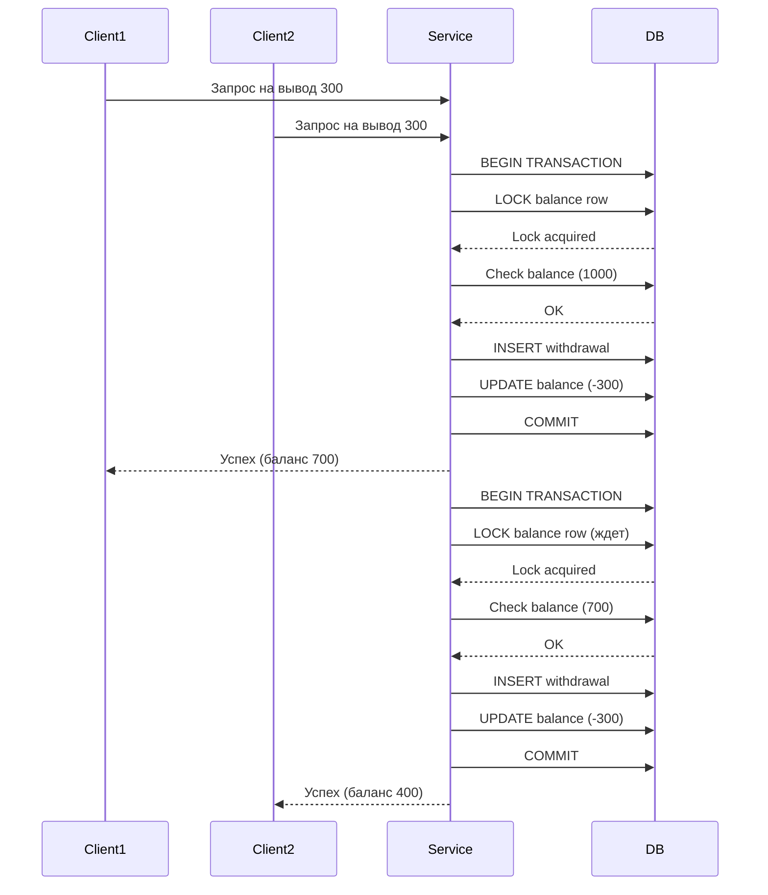

# Сервис Вывода Средств


**REST API сервис для обработки выводов средств с идемпотентностью и потокобезопасностью**


Makefile:

```makefile
.PHONY: build run test docker-up docker-down migrate lint clean

build:
	go build -o bin/withdrawal-api ./cmd/api

run:
	go run ./cmd/api/main.go

run-with-config:
	CONFIG_FILE=config/config.yaml go run ./cmd/api/main.go

run-production:
	CONFIG_FILE=config/config.production.yaml go run ./cmd/api/main.go

test:
	go test -v ./...

test-race:
	go test -race -v ./...

test-cover:
	go test -coverprofile=coverage.out ./...
	go tool cover -html=coverage.out

docker-up:
	docker-compose up -d

docker-down:
	docker-compose down

docker-logs:
	docker-compose logs -f

docker-build:
	docker-compose build

migrate:
	docker-compose exec postgres psql -U postgres -d withdrawal -f /docker-entrypoint-initdb.d/001_init.sql

lint:
	golangci-lint run

clean:
	rm -rf bin/
	docker-compose down -v

.PHONY: help
help:
	@echo "Available commands:"
	@echo "  make build              - Build the application"
	@echo "  make run                 - Run the application with default config"
	@echo "  make run-with-config     - Run with specific config file"
	@echo "  make run-production       - Run in production mode"
	@echo "  make test                 - Run tests"
	@echo "  make test-race            - Run tests with race detector"
	@echo "  make test-cover           - Run tests with coverage"
	@echo "  make docker-up            - Start docker containers"
	@echo "  make docker-down          - Stop docker containers"
	@echo "  make docker-logs          - View docker logs"
	@echo "  make migrate              - Run database migrations"
	@echo "  make clean                - Clean build artifacts"
```

Быстрый старт:

```makefile
make docker-up

curl http://localhost:8080/health
# Ожидаемый ответ: OK

curl -X POST http://localhost:8080/v1/withdrawals \
  -H "Authorization: Bearer test-token-123" \
  -H "Content-Type: application/json" \
  -d '{
    "user_id": "user-123",
    "amount": 100.50,
    "currency": "USDT",
    "destination": "0x742d35Cc6634C0532925a3b844Bc3e",
    "idempotency_key": "unique-key-123"
  }'

make docker-down
```

Ключевые архитектурные решения

SOLID принципы:

Single Responsibility - Каждый пакет отвечает за одну область: handler (HTTP), service (бизнес-логика), repository (данные)
Open/Closed - Интерфейсы в пакете port позволяют расширять функциональность без изменения существующего кода
Liskov Substitution - Любая реализация репозитория (PostgreSQL, mock, Redis) может быть подставлена без изменения вызывающего кода
Interface Segregation - Маленькие интерфейсы (WithdrawalRepository, BalanceRepository) вместо одного большого
Dependency Inversion - Сервис зависит от абстракций (port.WithdrawalRepository), а не от конкретной реализации

# Обеспечение корректности данных

Транзакции и блокировки

Для гарантии консистентности данных используется многоуровневая защита:

- 1. Уровень изоляции SERIALIZABLE

```go
tx, err := r.db.BeginTx(ctx, &sql.TxOptions{
    Isolation: sql.LevelSerializable,  // Самый строгий уровень изоляции
    ReadOnly:  false,
})
```

Предотвращает фантомные чтения, неповторяющиеся чтения и грязные чтения.

- 1. Блокировка строк (Row Locking)

```go
SELECT id FROM balances WHERE user_id = $1 FOR UPDATE NOWAIT
```

FOR UPDATE - блокирует конкретную строку баланса
NOWAIT - не ждет, если строка уже заблокирована (возвращает ошибку)

# Идемпотентность

```sql
-- Уникальное ограничение на idempotency_key
idempotency_key VARCHAR(255) UNIQUE NOT NULL
```

Как работает:

1. Клиент отправляет запрос с уникальным idempotency_key
2. При первом запросе создается запись в БД
3. При повторном запросе с тем же ключом возвращается сохраненный результат
4. Если ключ тот же, но данные разные - ошибка 422 Unprocessable Entity

# Конкурентность

Сценарий защиты от двойного списания:




# Безопасность

Authentication - Bearer token авторизация
Validation - Валидация всех входных данных
SQL Injection - Только prepared statements
Transactions - Атомарность операций
Row Locking - Блокировка строк вместо таблиц
No Leakage - Внутренние ошибки не возвращаются клиенту

# Производительность

Блокировки: Только строк, не таблиц
Индексы: На user_id, status, idempotency_key
Пул соединений: Настраиваемый размер пула
Таймауты: Настраиваемые таймауты на всех уровнях